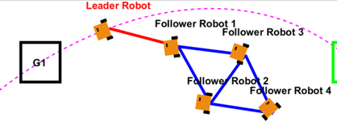
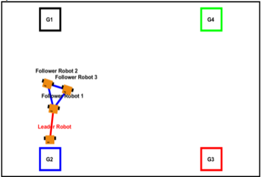
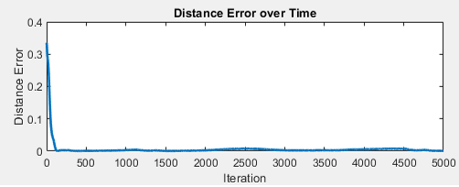
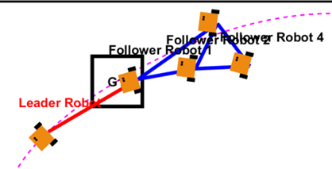
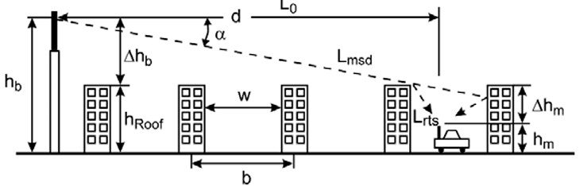
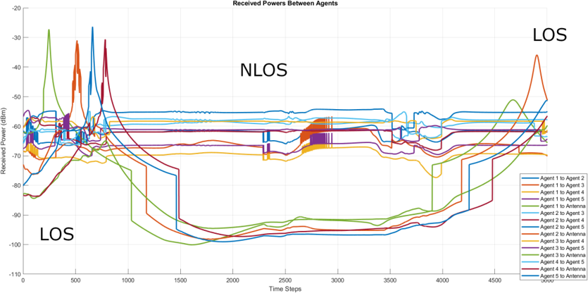

# 🤖 Cooperative Control Project - Mobile Robot Fleet


> **Context:** SY28 - Cyber-Physical Systems | UTC & Sorbonne University.
> **Authors:** [Justin FERDINAND](https://github.com/JustinF02) & [Alexis LEBEL](https://github.com/Alestrio)

This project implements a cooperative control system for a mobile robot fleet, integrating decision-making strategies, formation maintenance, and a realistic simulation of inter-agent communications (LTE/NB-IoT) in an urban environment.

---

## 🎯 Objectives

The goal is to simulate and control a fleet of robots (based on the *Robotarium* project) that must traverse a series of designated waypoints (G1 to G4) while maintaining formation and adapting to obstacles.



The system relies on two pillars:
1.  **Navigation & Control:** Formation maintenance and obstacle avoidance.
2.  **Communication:** Modeling of signal loss and Quality of Service (QoS) between agents.

---

## ⚙️ Control & Navigation Architecture

### 1. Trajectory Tracking Strategy
To ensure smooth navigation, we compared two approaches:
* **Spline Approach:** Tracking a predefined curve trajectory.
* **Command Law with Angle Approach Gain (Selected):** This method uses an angle approach to guide the robot toward the curve tangentially, ensuring a "smooth approach".

### 2. Topology and Formation (Laplacian)
The fleet consists of a Leader robot and Follower robots. To maintain cohesion, we use a **Laplacian matrix** to define the relationships and desired distances between agents.

The default formation is a **Rigid Diamond**, defined by the following matrix:

```math
L_{4} = \begin{pmatrix} 0 & -1 & 0 & 0 \\ -1 & 3 & -1 & -1 & 0 \\ 0 & -1 & 3 & -1 \\ 0 & -1 & -1 & 3 & -1 \\ 0 & 0 & -1 & 2 \end{pmatrix}


```


* **Validation:** The distance error converges rapidly to 0, validating the stability of the diamond topology.


### 3. Obstacle Management & Dynamic Adaptation

The environment contains obstacles defined by coordinates and a radius. Three detection zones (Critical, Near, Away) determine the behavior.

* **Problem:** The "Diamond" formation proved ill-suited for obstacle avoidance, causing followers to slow down and get congested while trying to catch up to the leader.
* **Solution:** Implementation of a dynamic topology change. During avoidance, the fleet switches to a **Line Topology**, where each robot follows the one in front of it.


---

## 📡 Hybrid Communication System (Simulated)

To validate the "Cyber-Physical" aspect, we simulate a realistic communication channel impacting coordination.

### 1. Network Architecture

The system uses a hybrid approach:
* **LTE (Primary Channel):** High data rate (up to 100 Mbps), low latency (<20ms). Used for critical control.
* **NB-IoT (Backup Channel):** Enhanced coverage (+20dB), energy-efficient, but lower data rate. Used as a backup when LTE fails.

### 2. Propagation Model (Walfisch-Ikegami)

The simulation integrates the **Walfisch-Ikegami** propagation model to calculate Path Loss based on the urban environment (building height, street width).

The total path loss equation accounts for:
* $L_{0}$: Free space loss.
* $L_{rts}$: Rooftop-to-street diffraction.
* $L_{msd}$: Multi-screen diffraction.


### 3. Key Quality Indicators (KPIs)

We monitor two real-time metrics to evaluate link reliability:

* **Received Power ($P_{RX}$):** Calculated via $P_{RX} = P_{TX} - L$ (with $P_{TX} = -15$ dBm).
* **Bit Error Rate (BER):** Simulated for BPSK modulation.

> **Simulation Results:** The graphs clearly show the impact of Non-Line-of-Sight (NLOS) zones. We observe drastic drops in received power and spikes in BER when robots pass behind buildings, confirming the necessity of the backup channel.

---

## 🚀 Conclusion & Results

This project led to the development of:
1.  Software components for multi-robot navigation in uncertain environments.
2.  An adaptive topology (Diamond $\leftrightarrow$ Line) for enhanced obstacle avoidance.
3.  A real-time QoS evaluation based on a hybrid LTE/NB-IoT architecture.



---

*Project realized as part of the SY28 module at the University of Technology of Compiègne (UTC)*